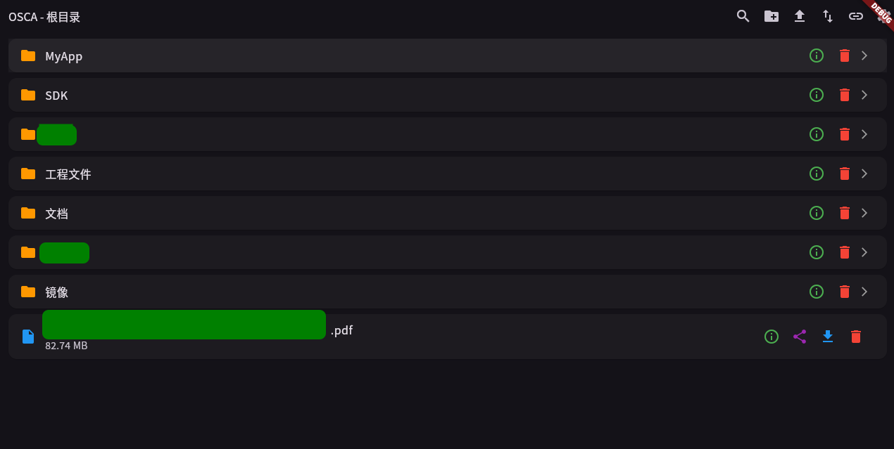
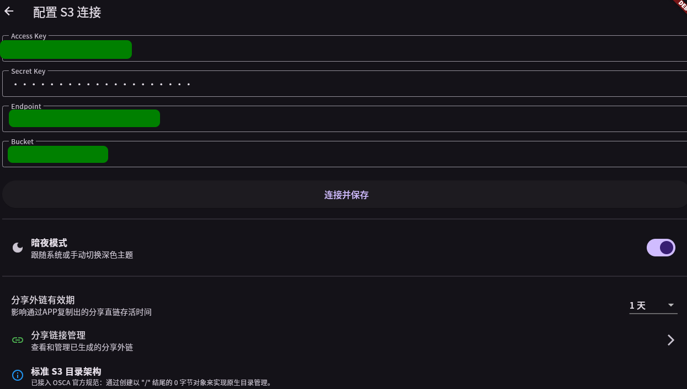
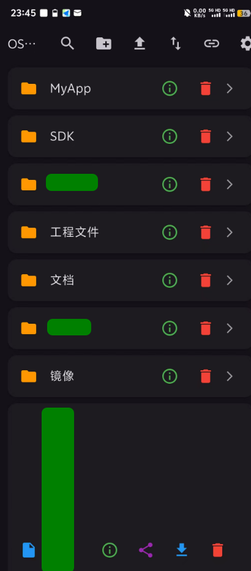

# OSCA Viewer

OSCA Viewer 是一个用于访问和管理 S3 兼容存储服务的桌面客户端应用程序。

## 功能特性

- **文件浏览**：查看远程存储桶中的文件和目录
- **文件上传**：将本地文件上传到远程存储（支持大文件分片上传）
- **文件下载**：将远程文件下载到本地（支持取消和进度显示）
- **文件删除**：删除远程文件或目录（支持递归删除）
- **文件重命名/移动**：支持文件的重命名和移动操作
- **创建文件夹**：支持创建原生 S3 文件夹（通过 0 字节对象标记）
- **认证配置**：配置访问 S3 兼容服务所需的认证信息
- **主题切换**：支持浅色和深色主题
- **文件搜索**：支持在当前目录中搜索文件
- **拖拽操作**：支持拖拽文件到文件夹中进行移动
- **进度显示**：显示上传/下载进度和传输速度
- **任务取消**：支持取消正在进行的上传/下载任务
- **UI生命周期管理**：修复了异步并发与UI生命周期不同步的bug，确保在大文件上传/下载完成前不会出现UI崩溃
- **跨平台支持**：支持 Windows、macOS、Linux、Android 和 iOS 平台
- **Linux桌面集成**：在Linux环境下提供原生桌面体验，包括桌面图标、应用菜单和文件管理器集成
- **多线程并发传输**：支持多线程并发上传/下载，大幅提升大文件传输效率
- **断点续传**：支持大文件分片上传/下载，具备断点续传能力
- **传输任务管理**：提供可视化的传输任务中心，实时监控上传/下载进度
- **外链分享**：支持生成文件的临时外链分享链接，可配置有效期
- **外链管理**：提供外链管理中心，可查看、复制和管理已生成的分享链接
- **文件属性查看**：支持查看文件的详细属性信息，包括大小、修改时间等
- **中文路径支持**：完美支持包含中文字符的文件名和路径
- **S3原生目录架构**：采用标准 S3 目录架构，通过创建以 "/" 结尾的 0 字节对象来实现原生目录管理
- **多选/批量任务**：允许批量下载，上传

以下是我个人的实际操作图片，目前是在Debian13为主要测试平台，但其他平台，例如手机，windows都是框架支持的
（手机和windows的平台我会在发布relese版本的时候进行测试以解决兼容性问题）





手机测试图片



以上是暗夜模式，但程序中可以切换为白昼模式，提供更亮眼的显示风格


## 依赖要求

- Flutter SDK (3.10.8+)
- Dart SDK (3.10.8+)

## 安装和使用

1. 确保已安装 Flutter SDK
2. 运行 `flutter pub get` 安装依赖
3. 运行 `flutter run` 启动应用程序

## 编译安卓Release版本

要编译安卓Release版本，请执行以下命令：

```bash
flutter build apk --release
```

编译完成后，Release版本的APK文件将生成在 `build/app/outputs/flutter-apk/app-release.apk`，文件大小约为49.4MB。

如需生成分架构的APK（更小的文件大小），可以使用：
```bash
flutter build apk --split-per-abi --release
```

这将生成针对不同CPU架构的APK文件，如armeabi-v7a、arm64-v8a和x86_64。

## 编译Linux Release版本

要编译Linux Release版本，请执行以下命令：

```bash
flutter build linux --release
```

编译完成后，Release版本的可执行文件将生成在 `build/linux/x64/release/bundle/osca_viewer`。

要运行该应用程序，请进入bundle目录并执行：
```bash
cd build/linux/x64/release/bundle
./osca_viewer
```

## Linux桌面环境集成

为了在Linux桌面环境中获得更好的体验，您可以使用提供的安装脚本来安装应用程序并配置桌面集成：

```bash
# 构建应用程序
flutter build linux --release

# 运行安装脚本（这将安装应用程序并配置桌面图标和菜单项）
./linux/install.sh
```

安装完成后，您可以通过以下方式启动 OSCA Viewer：
1. 在应用程序菜单中搜索 'OSCA Viewer'
2. 在终端中运行 `osca_viewer` 命令

## 卸载Linux版本

如果需要卸载已安装的OSCA Viewer，可以使用提供的卸载脚本：

```bash
# 运行卸载脚本（这将删除应用程序和桌面集成）
./linux/uninstall.sh
```

注意：运行Linux桌面应用程序需要系统安装相应的图形库依赖。

## 技术实现

- **S3 签名算法**：实现了 AWS S3 V4 签名算法，确保与 S3 兼容服务的安全通信
- **大文件上传**：支持大于 5MB 的文件分片上传，提高大文件传输效率
- **中文支持**：正确处理包含中文字符的文件名和路径
- **进度监控**：实时显示上传/下载进度和传输速度
- **错误处理**：完善的错误处理和用户提示机制
- **多线程并发**：采用多线程并发机制，支持多文件同时上传/下载
- **分片传输**：大文件采用分片传输技术，支持断点续传
- **文件锁机制**：使用文件锁确保并发写入的安全性
- **原生S3目录**：采用标准 S3 目录架构，通过 0 字节对象实现原生目录管理
- **外链生成**：支持生成带有效期的临时外链分享链接

## 项目结构

- `lib/main.dart`：应用程序主入口和主要页面
- `lib/services/s3_storage_service.dart`：S3 存储服务封装
- `lib/services/s3_signer.dart`：S3 签名算法实现

## 依赖库

- flutter: Flutter 框架
- shared_preferences: 本地配置存储
- file_picker: 文件选择器
- provider: 状态管理
- path_provider: 路径管理
- path: 路径操作
- http: HTTP 请求
- crypto: 加密算法（用于 S3 签名）
- intl: 国际化支持
- cupertino_icons: 图标库

## 许可证

[CC-BY-NC-SA]
